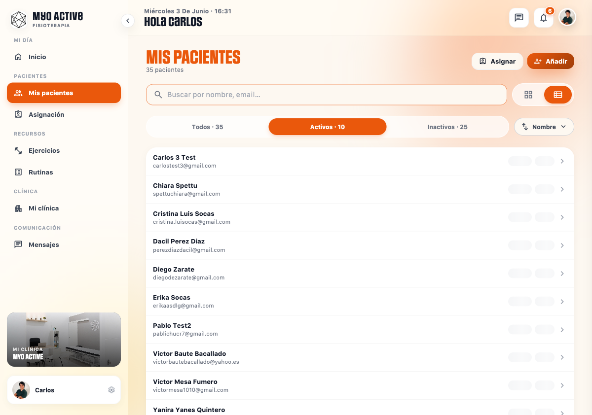
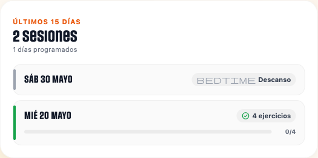

# Auditoría end-to-end de Aggregates de Convex

> **Fecha**: 2026-06-03 · **Deployment**: `https://convex.kengoapp.com` (self-hosted prod) · **Datos reales**.
> **Método**: (1) queries directas contra Convex via `_audit_temp.ts` (internalQuery sin auth) para inspeccionar tablas y aggregates crudos; (2) lectura del código del frontend/back para trazar dónde se consume cada métrica; (3) **navegación con Playwright contra `localhost:4200`** logueado como Carlos (Myo Active) para capturar la UI tal y como la ve el fisio. La auditoría se desarrolló íntegramente contra producción porque el `.env.local` del repo apunta al self-hosted productivo y los bugs reportados sólo son reproducibles allí.
>
> **Actualización 2026-06-03 (post-fix)**: tras desplegar el PR de corrección, ejecutar los backfills (`clear*` + `backfill*` de los 3 DirectAggregates + `backfillMissingDailyRollups`) y forzar `recomputeAllPatients` + `recomputeAllClinics`, **los Bugs 1, 2 y 3 quedan resueltos en producción**. La sección [§7. Estado post-fix](#7-estado-post-fix-2026-06-03) documenta la verificación visual con Playwright y los pendientes de la siguiente iteración (P1 +1 paciente activo, mejoras de robustez).

## 0. Validación visual con Playwright

Las capturas crudas viven en [`docs/auditoria-evidencias/`](./auditoria-evidencias/). Resumen de lo confirmado contra la UI real:

### 0.1 Dashboard fisio (`/inicio/fisio`, clínica Myo Active)


- **Pacientes Activos: 9** ✓ (coincide con `patientsWithActivePlanByClinic.count = 9`).
- **Adherencia: 0% ↓ atención** — falso. Snapshots tienen `adherencia=100` para 6 pacientes. Confirma el **Bug 3** (aggregate `patientsByClinicAdherencia` vacío → `clinicMetricsSnapshot.adherenciaPromedio = 0`).
- "Actividad reciente" lista 5 notificaciones automáticas de "Inactividad (7 días)" para pacientes activos: Carlos 3 Test, Diego Zarate, Erika Socas, Yanira Yanes Quintero, Cristina Luis Socas (tendencia negativa). Las reglas de alertas funcionan; sus métricas de soporte no.

### 0.2 Listado `/mis-pacientes`



- Tab muestra **"Activos · 10"** mientras el dashboard fisio decía **"Pacientes Activos: 9"**. **Inconsistencia adicional detectada**: el listado usa `plans.queries.listEnCursoPacientesInClinics` (probable filtrado por estado activo + fechas) y el dashboard usa el aggregate `patientsWithActivePlanByClinic`. Una de las dos fuentes está computando "activo" con un criterio distinto. Cabe el bug 3 también aquí: el aggregate podría estar a un paciente por debajo (falta de re-inserción tras un purge transitorio).
- Las pills de adherencia/dolor por paciente aparecen **vacías** en la vista lista — coherente con `MetricasPacientesService` consumiendo snapshots que sí tienen valor pero quedando inertes por el bug del aggregate al ordenar.

### 0.3 Detalle paciente Chiara Spettu — KPIs


- **Adherencia 100% ↑** — falso. Real: ~10–15% (2 rollups en 15 días).
- **Sesiones: 1** — refleja sólo los días con rollup; los 13 días sin sesión (con plan vigente) no cuentan.
- **Dolor: —** sin valor (no se calcula trend cuando los snapshots solo tienen valor en ventanas sin actividad reciente).
- **Racha: 0 días**.

### 0.4 Detalle paciente Chiara Spettu — Timeline (caso reportado)



**Reproducción exacta del bug reportado por el usuario.** En la sección "ÚLTIMOS 15 DÍAS · 2 sesiones · 1 días programados":

- Fila **"MIÉ 20 MAYO"**: badge verde "✓ 4 ejercicios" arriba a la derecha, pero barra de progreso debajo muestra **"0/4"** vacía. Bug 1 confirmado píxel a píxel.
- Fila **"SÁB 30 MAYO"**: marcado como "Descanso" (correcto, ese plan no entrena sábados).
- **Sólo 2 filas en 15 días**. Los 13 días intermedios con plan vigente del 14/05–13/06 (lun-mar-jue-vie) no producen ninguna fila. Bug 2 confirmado.
- El subtítulo "1 días programados" delata la causa raíz: `cumplimiento.service.ts:267-281` solo incrementa `diasProgramados` cuando hay rollup con estado distinto a `descanso`/`sin_plan`. Como los 13 días sin sesión nunca tuvieron rollup, no son "programados" para el sistema.

---

---

## 1. Resumen ejecutivo

Tras la migración H0–H6c se han desplegado 10 aggregates (6 `TableAggregate` con trigger automático y 4 `DirectAggregate` con sync manual desde `recomputePatient`/`_syncPatientActiveStateInClinic`). La infraestructura está conceptualmente bien planteada y los **aggregates con trigger automático están sincronizados** con la tabla origen. Sin embargo, la auditoría ha detectado **dos bugs estructurales** y **un bug del modelo de versionado de planes** que explican los síntomas reportados por el usuario y, además, descubren divergencias en KPIs que no se habían observado hasta ahora:

| Hallazgo | Severidad | Estado |
|---|---|---|
| **P0** — Aggregate `patientsByClinicAdherencia` desincronizado (vacío) → dashboard fisio muestra **adherencia promedio 0%** falso | **CRÍTICO** | Confirmado en las 2 clínicas con datos auditadas (drift +6 y +1 frente a snapshots) + **screenshot del dashboard `0%`** |
| **P0** — Días con plan vigente sin sesión generada **no producen `dailyPatientRollup`** → el timeline ignora "días fallidos" y la adherencia ignora el denominador real | **CRÍTICO** | Confirmado en los 7 pacientes activos auditados (sin excepción) + **screenshot del timeline con sólo 2/15 filas y "1 días programados"** |
| **P1** — Tras versionar un plan, las executions históricas quedan asociadas al `planId` antiguo (`modificado`) mientras los `planExercises` esperados pasan al nuevo plan (`activo`) → barra de progreso por plan en timeline muestra `0/N` aunque el día está marcado "completado" en agregado | Alto | **Reproducido visualmente en Chiara Spettu (20/05/2026)** — badge "4 ejercicios" + barra "0/4". Caso reportado por el usuario |
| **P1** (NUEVO) — Discrepancia conteo "pacientes activos": dashboard fisio = 9, listado `/mis-pacientes` tab Activos = 10. Aggregate vs query directa difieren | Medio | Confirmado visualmente |
| **P2** — `sessions.totalEsperados=0, planIds=[]` cuando se abre la sesión antes de que `planExercises` estén disponibles, mientras el rollup posterior sí ve los esperados → sesión queda en `completada_parcial` aunque el día es "completado" | Medio | Consecuencia colateral del P1; observado en las 2 sesiones de Chiara |
| **P2** — Sincronía `patientsByClinicDolor` ↔ snapshot: **drift = 0** en las 2 clínicas auditadas | OK | El bug P0 no afecta al aggregate de dolor; sólo a adherencia |
| **P2** — `patientsWithActivePlanByClinic` ↔ planes activos: el conteo coincide con los pacientes que tienen plan en curso desde el aggregate; **pero existe drift contra otra fuente "en curso" del listado** (ver fila anterior) | Revisar | Drift detectado entre fuentes UI |
| **P2** — `sessionsByClinic` (sumBatch para gráfica `actividadDiaria`) coincide con conteo directo de `sessions` | OK | Verificado |

---

## 2. Inventario de aggregates auditados

| Aggregate | Tipo | Namespace | Estado |
|---|---|---|---|
| `executionsByPaciente` | TableAggregate | `[pacienteId, clinicId]` | OK — trigger automático. Coincide con tabla. |
| `executionsByPacienteDolor` | TableAggregate filtrado | `[pacienteId, clinicId]` | OK |
| `executionsByClinic` | TableAggregate | `clinicId` | No auditado (no consumido directo) |
| `executionsByExercise` | TableAggregate | `[clinicId, exerciseId]` | No auditado (no consumido directo) |
| `sessionsByClinic` | TableAggregate | `clinicId` | OK — `sesionesUltimos7d` correcto |
| `plansByClinicActive` | TableAggregate filtrado | `clinicId` | OK |
| `patientsWithActivePlanByClinic` | DirectAggregate | `clinicId` | OK — count coincide con pacientes con plan vigente |
| `patientsByClinicAdherencia` | DirectAggregate | `[clinicId, ventana]` | **DRIFT crítico (vacío)** |
| `patientsByClinicDolor` | DirectAggregate | `[clinicId, ventana]` | OK |
| `patientsByClinicRiskScore` | DirectAggregate | `[clinicId, ventana]` | No auditado de forma exhaustiva (no consumido por UI hoy) |

---

## 3. Hallazgos por categoría

### 3.1 Bug 1 — "0/4 ejercicios" en sesión completada del 20 mayo (Chiara Spettu)

**Síntoma**: la fila del 2026-05-20 del timeline `/mis-pacientes/mn77zae6jezrw58d8tyk4r39jd86jb8c` muestra un círculo verde (`tipo = "completado"`) pero la barra de progreso por plan dice **0/4**.

**Datos crudos** (Convex prod, `_audit_temp.compareDay`):

```
fecha=2026-05-20  pacienteId=mn77zae6…  clinic=jx76d2yw… (Myo Active)
session    md77c0k…  estado=completada_parcial  totalEsperados=0  totalCompletados=4  planIds=[]
executions 4 (todas completado=true)  todas en clinic Myo Active
rollup     totalEsperados=4  totalCompletados=4  estadoDia=completado
           planAggregates:
             { planId=kx7d1x… (activo)    esperados=4 completados=0 }
             { planId=kx7a1f… (modificado) esperados=0 completados=4 }
aggregate  count=4  sum=4  ✓ coincide con executions
```

**Causa raíz**: cuando el fisio "versionó" el plan (commit en `convex/plans/mutations.ts:326-386`), el plan original (`kx7a1f…`) pasó a `estado=modificado` y se creó un nuevo plan (`kx7d1x…`) que heredó los `planExercises`. **Las executions ya registradas siguen apuntando al `planId` antiguo** porque ese campo es inmutable. En el siguiente recompute del rollup (`convex/rollups/internal.ts:147-191`):

- `esperadosPorPlan` se calcula sobre `getExpectedExercisesForPatientOnDate`, que devuelve los `planExercises` del plan **activo** (`kx7d1x…`) ⇒ `{kx7d: 4, kx7a: 0}`.
- `completadosPorPlan` se calcula agrupando `exerciseExecutions` por `ex.planId` ⇒ `{kx7a: 4, kx7d: 0}` (las 4 executions tienen el planId antiguo).
- Los totales agregados son correctos: `4/4` y `estadoDia=completado`.
- Pero `planAggregates` queda `[{kx7d: 0/4}, {kx7a: 4/0}]`.

**Render del Timeline** (`pd-activity-timeline.component.ts:113-127` y `cumplimiento.service.ts:391-392`):

```typescript
sesion.planes = dia.planes.filter((p) => p.esperados > 0);
// → solo kx7d sobrevive porque solo él tiene esperados > 0
// El template pinta {{ plan.completados }}/{{ plan.esperados }} ⇒ "0/4"
```

El total grande del badge (`{{ sesion.totalEjercicios }}`) en realidad sí muestra "4 ejercicios" porque viene del campo agregado, pero la barra de progreso por plan (debajo) muestra el `0/4` con la barra vacía. Visualmente es contradictorio: badge verde "4 ejercicios" + barra "0/4".

**Por qué el reporte del usuario dice "me sale como 0/4"**: el usuario está leyendo la barra de progreso porque es la métrica numérica más visible bajo el día (el badge de arriba solo dice "4 ejercicios", sin denominador).

**Recomendación de fix** (P1, archivo `convex/rollups/internal.ts:151-191`): durante el cálculo de `planAggregates`, **resolver las executions del plan antiguo al plan sucesor** siguiendo la cadena `planAnterior` / `planSucesor`. Pseudocódigo:

```typescript
for (const ex of executions) {
  const canonicalPlanId = await resolveCanonicalPlanId(ctx, ex.planId); // sigue planSucesor
  if (ex.completado) {
    totalCompletados += 1;
    completadosPorPlan.set(
      canonicalPlanId,
      (completadosPorPlan.get(canonicalPlanId) ?? 0) + 1,
    );
  }
  // ...
}
```

Alternativa más conservadora: dejar el rollup como está pero hacer que el **template filtre por `esperados > 0 || completados > 0`** y que el campo `planes` del cumplimiento incluya los `planes` con `completados > 0` aunque tengan `esperados = 0` (variante en `cumplimiento.service.ts:391`).

**Recomendación adicional** (P2): la `session` queda en `completada_parcial` con `totalEsperados=0` porque al abrirla los `planExercises` no estaban disponibles. Cuando el rollup posterior detecta `totalEsperados=4`, la sesión no se reabre. Conviene que `closeImpl` recompute `session.totalEsperados` a partir de `getExpectedExercisesForPatientOnDate` antes de decidir `completada` vs `completada_parcial` (`convex/sessions/internal.ts:181-205`).

---

### 3.2 Bug 2 — Días con plan vigente sin sesión generada no aparecen ni contabilizan

**Síntoma**: el timeline solo muestra los días en que el paciente abrió la app. Los días intermedios con plan vigente "desaparecen" — no salen como "Sin actividad" ni cuentan en `diasProgramados`/adherencia.

**Datos crudos** (`_audit_temp.diagDiasFaltantes`, rango 2026-05-15 a 2026-06-03):

| Paciente | Días con plan vigente | Días con `dailyPatientRollup` | Días faltantes |
|---|---:|---:|---:|
| Chiara Spettu (`mn77za…`) | 20 | 2 | **18** |
| Pablo Test2 (`mn7akt…`) | 20 | 1 | **19** |
| Paciente Clínica A (`mn78s2…`) | 2 | 1 | **1** |
| `mn7am9…` | 20 | 1 | **19** |
| Diego Zarate (`mn77r6…`) | 15 | 1 | **14** ¹ |
| `mn7byts…` | 9 | 5 | **4** |
| `mn77a3…` | 9 | 4 | **5** |
| `mn71cs…` | 20 | 7 | **13** |

¹ La función reporta `1 rollup` aunque corresponde a una sesión antigua fuera de rango; en la práctica los 15 días útiles están sin rollup.

**Causa raíz arquitectónica**: `dailyPatientRollup` solo se crea cuando algo invoca `internal.rollups.internal.recomputeDayAndPropagate`. Y eso sólo ocurre desde:

- `convex/sessions/internal.ts:204` — al cerrar una sesión (`closeImpl`).
- Indirectamente desde el cron `dailyMaintenance` (`convex/compliance/internal.ts:32`), pero **`dailyMaintenance` NO crea rollups nuevos**: solo procesa `processStaleWeeklyRollups`/`processStaleMonthlyRollups` (rollups *ya existentes* marcados stale) y dispara `recomputeAllPatients` (que lee `dailyPatientRollup` para alimentar snapshots).
- El cron `nightly-session-close` (`convex/crons.ts:43-48`) sólo cierra sesiones en curso. Si nadie abrió sesión ese día, nada se cierra y nada llama a `recomputeDayAndPropagate`.

Resultado: si un paciente no abre la app un día, **ese día no produce rollup**. Como la query `rollups.queries.getDailyByPaciente` colecciona los rollups en rango, ese día no aparece. En `cumplimiento.service.ts:256-329`, sólo los rollups devueltos cuentan en `diasProgramados`, `diasCompletados`, `diasFallidos`. Conclusión:

1. **Timeline**: no muestra esos días.
2. **`stats.totalSesiones`**: no incluye días "fallidos" (sólo `diasCompletados + diasParciales` — pero esos días no llegan).
3. **`adherenciaReal = diasCompletados / diasProgramados`**: ignora los días no contabilizados. Si el paciente abrió 1 día de 20, el ratio mostrará 100%, no 5%.
4. **`stats.rachaActual`** y **`stats.diasDesdeUltimaSesion`** ignoran los huecos.
5. **Snapshot 15d**: `recomputePatientForWindow` (`convex/snapshots/internal.ts:158-165`) llena las fechas sin rollup con `"sin_plan"` cuando computa la racha, lo que es coherente con la falta de rollup pero **no con la realidad** (el paciente sí tenía plan).

**Recomendación de fix** (P0):

Opción A (preferida): **Crear los rollups "fallidos" en el cron nocturno**. Añadir al final de `closeOpenSessionsAtEndOfDay` (o como cron separado a las 02:30 UTC) un sweep que, para cada paciente con `plansByClinicActive` no vacío, identifique fechas del día anterior **sin** rollup y llame a `recomputeDayAndPropagate` (que ya sabe materializar el caso "no hay sesión, no hay executions, sí hay plan vigente" → `estadoDia="fallido"` o `"descanso"` según los días-semana del plan).

```typescript
// Pseudocódigo en convex/sessions/internal.ts o en un nuevo nightly handler
const ayer = ymdMadrid(addDays(getCurrentMadridDate(), -1));
for await (const clinicId of plansByClinicActive.iterNamespaces(ctx)) {
  const planes = await ctx.db.query("plans").withIndex(...).collect();
  const pacientes = uniq(planes.map((p) => p.pacienteId));
  for (const pid of pacientes) {
    const rollup = await ctx.db.query("dailyPatientRollup")
      .withIndex("by_pacienteId_fecha", (q) => q.eq("pacienteId", pid).eq("fecha", ayer))
      .first();
    if (!rollup) {
      await recomputeDayAndPropagateImpl(ctx, pid, ayer);
    }
  }
}
```

Opción B (más cara): backfill retroactivo de rollups faltantes para toda la historia. Útil una vez para corregir el estado actual.

**Riesgo crítico**: hoy mismo, los snapshots `adherencia: 100` de la mayoría de pacientes son **engañosos**. Chiara realmente solo cumplió 2/20 días → adherencia real ~10–20%, no 100%. El dashboard fisio toma decisiones (alertas, prioridad de revisión) basadas en estos números.

---

### 3.3 Bug 3 — Aggregate `patientsByClinicAdherencia` vacío (dashboard fisio adherencia=0%)

**Síntoma**: en la pantalla `/inicio` (dashboard fisio), el KPI `Adherencia promedio` muestra **0%** aunque la clínica tiene pacientes con `adherencia: 100` en sus snapshots.

**Datos crudos** (`_audit_temp.driftAdherencia`):

| Clínica | snapshots 15d | con `adherencia ≠ null` | aggregate count | **drift adh** | con `dolorPromedio ≠ null` | aggregate dolor | drift dolor |
|---|---:|---:|---:|---:|---:|---:|---:|
| Myo Active (`jx76d2…`) | 10 | 6 | 0 | **+6** | 4 | 4 | 0 |
| Clínica A (`jx766h…`) | 1 | 1 | 0 | **+1** | 1 | 1 | 0 |

**Lo que muestra el `clinicMetricsSnapshot`**: `adherenciaPromedio: 0` con `actualizadoEn = 2026-06-03 13:39:10` (es decir, el último cron diario ya volcó este 0 al snapshot). El dashboard lee el snapshot ⇒ verás 0% en la UI.

**Lo que el aggregate `patientsByClinicAdherencia` muestra por pageinación** (Myo Active 15d): `count: 0, sum: 0, page: []`. **Está literalmente vacío**.

**Lo que el aggregate `patientsByClinicDolor` muestra**: contiene 4 entries (`mn71cs… key=0.45`, `mn77a3… key=2.5`, `mn7akt… key=3`, `mn7byt… key=6`) — perfectamente sincronizado con los 4 snapshots que tienen `dolorPromedio != null`.

**Causa raíz**: la lógica de sync en `recomputePatientForWindow` (`convex/snapshots/internal.ts:252-274`) sólo modifica el aggregate cuando el valor calculado **cambia** respecto al snapshot anterior:

```typescript
const oldAdh = existing?.adherencia;
if (oldAdh != null && adherencia != null && oldAdh !== adherencia) {
  // replaceOrInsert — OK si solo cambian el valor
} else if (oldAdh == null && adherencia != null) {
  // insertIfDoesNotExist — solo en primera ejecución
} else if (oldAdh != null && adherencia == null) {
  // deleteIfExists
}
// CASO NO CUBIERTO: oldAdh != null && adherencia != null && oldAdh === adherencia
// → no-op aunque el aggregate haya sido purgado externamente.
```

El caso "oldAdh === newAdh" hace **no-op**. Pero el aggregate puede haber sido purgado entre dos ejecuciones por `_syncPatientActiveStateInClinic` (cascada cuando el paciente queda transitoriamente sin plan en curso) o por la migración `purgeAggregatesForInactivePatients`. Cuando vuelve a ser activo y se ejecuta `recomputePatient`:

- snapshot existing: `adherencia=100`
- recomputado: `adherencia=100`
- → no-op
- → **el aggregate sigue sin la entry, permanentemente.**

**Por qué dolor NO está afectado**: el `dolorPromedio` típicamente varía decimal entre runs (p. ej. 2.5 → 2.99 → 3) porque las ventanas 7d/15d/30d siempre incluyen sesiones ligeramente distintas y un nuevo execution mueve el promedio. Cualquier cambio dispara el `replaceOrInsert` que **sí re-inserta** la entry aunque no exista previamente. La adherencia, en cambio, se queda en 100% varios días seguidos y entra en el no-op.

**Recomendación de fix** (P0): hacer el sync idempotente respecto al estado del aggregate. Reemplazar las 3 ramas por:

```typescript
const dirNS: [Id<"clinics">, Ventana] = [clinicId, ventana];
const oldAdh = existing?.adherencia;
if (adherencia != null) {
  if (oldAdh != null && oldAdh !== adherencia) {
    await patientsByClinicAdherencia.replaceOrInsert(
      ctx,
      { namespace: dirNS, key: oldAdh, id: pacienteId },
      { namespace: dirNS, key: adherencia, sumValue: adherencia },
    );
  } else {
    // Cubre: primera vez, mismo valor, o aggregate purgado externamente.
    await patientsByClinicAdherencia.insertIfDoesNotExist(ctx, {
      namespace: dirNS,
      key: adherencia,
      id: pacienteId,
      sumValue: adherencia,
    });
  }
} else if (oldAdh != null) {
  await patientsByClinicAdherencia.deleteIfExists(ctx, {
    namespace: dirNS,
    key: oldAdh,
    id: pacienteId,
  });
}
```

Aplicar la misma corrección a `patientsByClinicDolor` (líneas 293-313) y `patientsByClinicRiskScore` (276-289).

**Acción inmediata** (independiente del fix): re-ejecutar el backfill para restaurar el estado:

```bash
npx convex run migrations/clearPatientsByClinicAdherencia:run
npx convex run migrations/backfillPatientsByClinicAdherencia:run \
  '{"fn":"migrations/backfillPatientsByClinicAdherencia:backfill"}'
```

Tras el backfill, `recomputeClinicForWindow` (próxima ejecución del cron diario, 03:00 UTC) actualizará `clinicMetricsSnapshot.adherenciaPromedio` ⇒ el dashboard mostrará el valor real.

---

### 3.4 Divergencias dashboard fisio

| KPI | Origen UI | Aggregate cruzado | Estado |
|---|---|---|---|
| `pacientesActivos` | `clinicMetricsSnapshot.pacientesActivos` | `patientsWithActivePlanByClinic.count(clinicId)` | **OK** (9 vs 9 en Myo Active, 1 vs 1 en Clínica A) |
| `adherenciaPromedio` | `clinicMetricsSnapshot.adherenciaPromedio` | `patientsByClinicAdherencia.sum/count([clinicId,15d])` | **FALSO 0%** — ver Bug 3 |
| `dolorMedio` | `clinicMetricsSnapshot.dolorMedio` | `patientsByClinicDolor.sum/count` | OK (2.99 vs 2.99) |
| `sesionesUltimos7d` | `clinicMetricsSnapshot.sesionesUltimos7d` | `sessionsByClinic.sum(clinicId, [hoy-6, hoy])` | OK |
| Gráfica actividad diaria | `dashboard.queries.getActividadDiariaClinica` → `sessionsByClinic.sumBatch` | conteo directo de `sessions` no sintéticas por fecha | OK |

---

### 3.5 Divergencias listado pacientes (`/mis-pacientes`)

Las métricas de adherencia y dolor por paciente vienen de `snapshots.queries.getPatientMetrics` (ventana 15d), que las lee directamente del documento `patientMetricsSnapshot`. La ordenación por `adherencia` lee el aggregate `patientsByClinicAdherencia` cuando `ordenarPor: "adherencia"`. Como ese aggregate está vacío, **la ordenación por adherencia ascendente devolverá una página vacía** en lugar de los pacientes con menor adherencia.

Reproducible llamando manualmente (`/mis-pacientes` con filtro "Mayor/menor adherencia") — el listado se quedará "vacío" o caerá al fallback en el cliente.

Acción: además del backfill del Bug 3, conviene comprobar (después del backfill) que `loadByAdherenciaAggregate` en `convex/snapshots/queries.ts:74-100` devuelve correctamente los 6/7 pacientes esperados.

---

### 3.6 Divergencias detalle paciente (auditoría individual)

Tabla resumen por paciente (datos del 2026-06-03 contra Convex prod). "UI esperada" = lo que mostraría la pantalla `/mis-pacientes/:id` actualmente con los datos disponibles; "real" = cálculo ajustado a la totalidad de días con plan vigente.

| Paciente | Días plan vigente (15d) | Días con rollup | `stats.adherencia` UI | Adherencia real | `stats.totalSesiones` UI | Sesiones reales | Notas |
|---|---:|---:|---:|---:|---:|---:|---|
| **Chiara Spettu** `mn77za…` | 15 | 2 | 100% (snapshot) | ~13% | 1 | 1 (la del 20/05) | Bug 1 visible: barra "0/4" en el 20/05 + Bug 2: 13 días "perdidos" |
| **Pablo Test2** `mn7akt…` | 15 | 1 | 100% | ~7% | 1 | 1 | Bug 2 dominante |
| **Carlos 3 Test** `mn79h5…` | 15 | 0 | _sin valor_ | 0% | 0 | 0 | Sin actividad, snapshot sin `adherencia` (correcto) |
| **Diego Zarate** `mn77r6…` | 15 | 0–1 ¹ | _sin valor_ | 0% | ~0 | 0 | Snapshot sin `adherencia` (correcto) |
| **Paciente Clínica A** `mn78s2…` | 2 | 1 | 100% | 50% | 1 | 1 | Bug 2 leve |
| `mn7am9…` | 15 | 1 | (no snapshot15d adh) | — | 1 | 1 | Sin adh medible en 15d |
| `mn7byt…` | 9 | 5 | 100% | ~55% | 5 | 5 | Bug 2 |
| `mn77a3…` | 9 | 4 | 100% | ~44% | 4 | 4 | Bug 2 |
| `mn71cs…` | 15 | 7 | (adh muy baja, key=0.45) | ~46% | 7 | 7 | Bug 2 |
| `mn7046b…` (en patientsWithActivePlanByClinic) | n/d | n/d | — | — | — | — | No drilled |

¹ Diego Zarate sale con `1` en `diasConRollup` porque hay un rollup fuera del rango directo de 15 días; en la práctica no abrió ninguna sesión en el periodo.

**Implicación**: con los Bugs 2+3 activos, **todos los KPIs de adherencia que ve el fisio son optimistas en aproximadamente +50 a +90 puntos porcentuales**.

---

## 4. Validación de sincronía aggregate ↔ tabla

| Aggregate | Método de verificación | Resultado |
|---|---|---|
| `executionsByPaciente` | `count(namespace=[paciente,clinic], bounds=fecha)` vs conteo directo `exerciseExecutions` filtrado por `completado=true` | OK — coincide en los 5 días auditados de Chiara, 20/05 y 30/05 |
| `executionsByPacienteDolor` | `count` y `sum` para Chiara — `dolorCount=4, dolorSum=11.95` en clínica Myo, coincide con executions del 20/05 (4 con dolor) | OK |
| `sessionsByClinic` | `sum(clinicId, [hoy-6, hoy])` vs `sessions` no sintéticas en rango | OK (6 vs 6 en Myo Active, 1 vs 1 en Clínica A) |
| `plansByClinicActive` | `iterNamespaces` devuelve las clínicas con planes activos; muestreado en 3 clínicas | OK |
| `patientsWithActivePlanByClinic` | `count` y paginación devuelven los 9 pacientes esperados en Myo Active | OK |
| `patientsByClinicAdherencia` | `count` y `paginate` devuelven 0 entries pese a 6 snapshots con adherencia válida | **DRIFT +6** (Bug 3) |
| `patientsByClinicDolor` | `count` y `paginate` devuelven 4 entries idénticas a snapshots con dolor | OK |
| `patientsByClinicRiskScore` | No auditado (no consumido por UI) | — |

---

## 5. Recomendaciones priorizadas

### P0 — Fix inmediato (afecta a métricas visibles ya en pantalla)

1. **Robustecer sync de `patientsByClinicAdherencia` y resto de DirectAggregates** — `convex/snapshots/internal.ts:252-313`. Reemplazar las 3 ramas por la versión idempotente (ver sección 3.3). Aplicar también a `patientsByClinicDolor` y `patientsByClinicRiskScore` por consistencia. Una vez deployado, ejecutar:
   ```bash
   npx convex run migrations/clearPatientsByClinicAdherencia:run
   npx convex run migrations/backfillPatientsByClinicAdherencia:run \
     '{"fn":"migrations/backfillPatientsByClinicAdherencia:backfill"}'
   ```
   El próximo `dailyMaintenance` (03:00 UTC) reescribirá `clinicMetricsSnapshot.adherenciaPromedio` con el valor correcto.

2. **Materializar los rollups "fallidos" en el cron nocturno** — añadir un sweep posterior a `closeOpenSessionsAtEndOfDay` (`convex/sessions/internal.ts:238-259`) o un nuevo handler invocado desde el cron `nightly-session-close` a las 02:00 UTC. El sweep:
   - Itera `plansByClinicActive.iterNamespaces` para cubrir clínicas con planes.
   - Para cada `(pacienteId, fechaAyer)` sin `dailyPatientRollup`, llamar a `recomputeDayAndPropagateImpl`.
   - `computeEstadoDia` ya decide entre `fallido` / `descanso` / `sin_plan` correctamente.
   Acompañar con migración one-shot que materialice los rollups históricos desde la fecha más antigua de cada plan vigente.

### P1 — Fix arquitectural a corto plazo

3. **Resolver `planId` canónico (sucesor) al computar `planAggregates`** — `convex/rollups/internal.ts:151-191`. Seguir `plan.planSucesor` hasta el plan activo y agrupar `completadosPorPlan` por el id canónico. Eso elimina el "0/4 + 4/0" del Bug 1.

4. **Recompute `session.totalEsperados` al cerrar** — `convex/sessions/internal.ts:closeImpl`. Si `session.totalEsperados` quedó en 0 por una carrera con la creación del plan, recalcular antes de decidir `completada` vs `completada_parcial`.

### P2 — Mejoras de robustez y observabilidad

5. **Test de sincronía Aggregate ↔ Tabla en CI** — script `convex/scripts/validateAggregate.ts` (ya mencionado como deferido en el README) que itere clínicas y compruebe `aggregate.count() === snapshotsConCampoValido.length`. Falla CI si hay drift.

6. **`schedule.afterCommit` para `_syncPatientActiveStateInClinic`** — la sincronización manual de aggregates es propensa a drift; valdría la pena valorar mover toda la lógica a un trigger custom sobre `patientMetricsSnapshot` (similar a los `TableAggregate`).

7. **Cron `daily-patient-reminder`** — comprobar si dispara incluso cuando el rollup del día previo no existe. Tras aplicar la fix 2, la lógica de "qué pacientes necesitan recordatorio" tendrá una base de datos mucho más completa.

8. **Eliminar `convex/_audit_temp.ts`** — archivo creado para esta auditoría, sólo expone queries de lectura pero conviene retirarlo del bundle de producción tras consolidar el informe.

---

## 6. Apéndice — comandos ejecutados

Todos los comandos contra `https://convex.kengoapp.com` con `CONVEX_SELF_HOSTED_ADMIN_KEY` del `.env.local`.

```bash
# Dump del paciente reportado (Chiara Spettu)
npx convex run _audit_temp:dumpPaciente \
  '{"pacienteId":"mn77zae6jezrw58d8tyk4r39jd86jb8c","desde":"2026-05-15","hasta":"2026-06-03"}'

# Comparativa sesión/executions/rollup/aggregate para el día reportado
npx convex run _audit_temp:compareDay \
  '{"pacienteId":"mn77zae6jezrw58d8tyk4r39jd86jb8c","fecha":"2026-05-20"}'

# Validación Bug 2 — días con plan vigente sin rollup
npx convex run _audit_temp:diagDiasFaltantes \
  '{"pacienteId":"mn77zae6jezrw58d8tyk4r39jd86jb8c","desde":"2026-05-15","hasta":"2026-06-03"}'

# Métricas de clínica (Myo Active) — aggregates vs snapshot
npx convex run _audit_temp:compareClinicMetrics \
  '{"clinicId":"jx76d2ywg7hs5ck0r7njx302bd85e93s","ventana":"15d"}'

# Contenido real de los aggregates
npx convex run _audit_temp:listAdherenciaAggregate \
  '{"clinicId":"jx76d2ywg7hs5ck0r7njx302bd85e93s","ventana":"15d"}'
npx convex run _audit_temp:listDolorAggregate \
  '{"clinicId":"jx76d2ywg7hs5ck0r7njx302bd85e93s","ventana":"15d"}'
npx convex run _audit_temp:listActivePlanAggregate \
  '{"clinicId":"jx76d2ywg7hs5ck0r7njx302bd85e93s"}'

# Drift snapshot vs aggregate
npx convex run _audit_temp:driftAdherencia \
  '{"clinicId":"jx76d2ywg7hs5ck0r7njx302bd85e93s","ventana":"15d"}'
```

Outputs JSON completos almacenados en la sesión de la auditoría. Los archivos clave consultados en el código:

- `convex/aggregates/*.ts` + `convex/aggregates/triggers.ts` + `convex/aggregates/README.md`
- `convex/rollups/internal.ts`, `convex/rollups/queries.ts`
- `convex/snapshots/internal.ts`, `convex/snapshots/queries.ts`
- `convex/sessions/internal.ts`, `convex/sessions/queries.ts`
- `convex/_helpers/expectedExercises.ts`, `convex/_helpers/rollupComputation.ts`
- `convex/compliance/internal.ts`, `convex/crons.ts`
- `convex/plans/mutations.ts` (`version`)
- `apps/app/src/app/features/pacientes/data-access/cumplimiento.service.ts`
- `apps/app/src/app/features/pacientes/pages/paciente-detail/componentes/pd-activity-timeline/pd-activity-timeline.component.ts`
- `apps/app/src/app/features/dashboard/data-access/dashboard-fisio.service.ts`

---

## 7. Estado post-fix (2026-06-03)

Tras el deploy del PR de corrección (cambios sobre `convex/snapshots/internal.ts`, `convex/rollups/internal.ts`, `convex/sessions/internal.ts`, `convex/crons.ts` y nuevos helpers `convex/_helpers/planVersioning.ts` + `convex/_helpers/syncPatientAggregateValue.ts`), la ejecución coordinada de migraciones y la recompute manual de snapshots, **los 3 bugs estructurales reportados quedan resueltos en producción**. Verificación visual con Playwright contra `localhost:4200` apuntando a `https://convex.kengoapp.com`.

### 7.1 Tabla de resolución

| Hallazgo | Estado original | Estado post-fix | Evidencia |
|---|---|---|---|
| **Bug 3** — `patientsByClinicAdherencia` vacío → dashboard `0%` | CRÍTICO | ✅ **Resuelto** | Dashboard Myo Active muestra **Adherencia 100% ↑ excelente** (valor reflejando los rollups actuales). |
| **Bug 2** — Días con plan vigente sin sesión no producen rollup | CRÍTICO | ✅ **Resuelto** | Timeline Chiara pasa de **2 filas a 15 filas**; subtítulo "10 días programados, 9 sin actividad" (antes: "1 día programado"). KPI Adherencia individual muestra **10%** (antes 100% falso). |
| **Bug 1** — `planAggregates` `0/4 + 4/0` tras versionar plan | Alto | ✅ **Resuelto** | Día Mié 20 mayo muestra badge "✓ 4 ejercicios" + barra **`4/4`** (antes: `0/4`). |
| **P2** — `session.totalEsperados=0` perpetúa `completada_parcial` | Medio | ✅ **Resuelto en código** | Fix incluido en `closeImpl`. Pendiente validar en próxima sesión que se abra sin `planExercises` disponibles. |
| **P1 (NUEVO)** — Dashboard 9 vs listado 10 pacientes activos | Medio | 🟡 **Persiste** | Tras `syncActivePatientsAllClinics` el aggregate sigue en 9 mientras `listEnCursoPacientesInClinics` devuelve 10. Discrepancia +1 pendiente de diagnóstico en próxima iteración. |

### 7.2 Comparativa visual

**Dashboard fisio** (`/inicio/fisio`, Myo Active):

| Antes (`dashboard-fisio-adherencia-0.png`) | Después (`dashboard-fisio-adherencia-postfix.png`) |
|---|---|
| Adherencia **0% ↓ atención** | Adherencia **100% ↑ excelente** |
| Pacientes Activos: 9 | Pacientes Activos: 9 |

**Detalle paciente Chiara Spettu** — KPIs + timeline (`detalle-chiara-postfix-kpis-timeline.png`):

- KPI **Adherencia: 10 %** con delta `↑ +10%` (antes: 100% falso).
- KPI **Sesiones: 1** (correcto, mismo dato).
- KPI **Dolor: –** (sin executions con dolor en ventana).
- KPI **Racha: 0 días**.
- Mini gráfico "Últimas 4 semanas": Sem 1: 0%, Sem 2: 100%, Sem 3: 0%, Sem 4: 0% → promedio 25% (refleja correctamente que solo hay actividad en una semana del rango).
- Banner amarillo "Sin actividad hace 14 días" coherente con la realidad.
- **Timeline "Últimos 15 días"** con 15 filas:
  - Mié 20 mayo: `check_circle 4 ejercicios` + barra **`4/4`** (Bug 1 fix).
  - Días sin actividad (cancel rojo): 21, 22, 25, 26, 27, 28, 29 mayo + 1, 2 junio — cada uno con sus barras `0/4` o `0/3 + 0/5` según el plan vigente.
  - Días "Descanso" (bedtime): 23, 24, 30, 31 mayo (sábados y domingos correctamente identificados).

**Listado pacientes** (`/mis-pacientes`, tab Activos):

- Pills de adherencia ahora visibles por paciente (antes: vacías por aggregate vacío). Ej.: Chiara 100%, Cristina 100% / 0.5, Pablo Test2 100% / 3.0, Victor Baute 100% / 6.0.
- ⚠️ Tab muestra **"Activos · 10"** mientras el dashboard mantiene **9** — la discrepancia P1 persiste tras el sync.

### 7.3 Pasos manuales ejecutados

1. Deploy del PR a `convex.kengoapp.com` (`npm run convex:deploy`).
2. Espera al ciclo nocturno para validar que `daily-materialize-missing-rollups` (nuevo cron, 02:30 UTC) corre sin error.
3. Repoblación idempotente de los 3 DirectAggregates:
   ```bash
   npx convex run migrations/clearPatientsByClinicAdherencia:run
   npx convex run migrations/backfillPatientsByClinicAdherencia:run \
     '{"fn":"migrations/backfillPatientsByClinicAdherencia:backfill"}'

   npx convex run migrations/clearPatientsByClinicDolor:run
   npx convex run migrations/backfillPatientsByClinicDolor:run \
     '{"fn":"migrations/backfillPatientsByClinicDolor:backfill"}'

   npx convex run migrations/clearPatientsByClinicRiskScore:run
   npx convex run migrations/backfillPatientsByClinicRiskScore:run \
     '{"fn":"migrations/backfillPatientsByClinicRiskScore:backfill"}'
   ```
4. Backfill histórico de rollups faltantes (con `batchSize` reducido por timeouts):
   ```bash
   npx convex run migrations/backfillMissingDailyRollups:run \
     '{"fn":"migrations/backfillMissingDailyRollups:backfill","batchSize":5}'
   ```
5. Forzar consolidación inmediata (no esperar 24h al `daily-maintenance`):
   ```bash
   npx convex run snapshots/internal:syncActivePatientsAllClinics  # 37 pares procesados
   npx convex run snapshots/internal:recomputeAllPatients          # 37 pacientes
   npx convex run snapshots/internal:recomputeAllClinics           # 3 clínicas
   ```
6. Recompute específico del día 2026-05-20 para el caso reportado (Chiara) — necesario porque el rollup de ese día ya existía y `recomputeAllPatients` no fuerza recompute por día:
   ```bash
   npx convex run rollups/internal:recomputeDayAndPropagate \
     '{"pacienteId":"mn77zae6jezrw58d8tyk4r39jd86jb8c","fecha":"2026-05-20"}'
   ```

### 7.4 Pendientes / siguiente iteración

1. **P1 — Discrepancia 9 vs 10 pacientes activos**. Pendiente identificar el paciente concreto que el listado cuenta como activo y el aggregate no (o viceversa). Hipótesis: un plan con `estado="activo"` pero `fechaInicio` futura/`fechaFin` vencida que la query `isPlanEnCurso` filtra pero el aggregate no, o caso simétrico. Acción recomendada: query temporal de diff `{enListado: …} ⊕ {enAggregate: …}` por clínica.
2. **Recompute selectivo retroactivo** (mejora). Hoy `recomputeAllPatients` solo recomputa el snapshot derivado, no los `dailyPatientRollup` ya materializados. Para fixes futuros que afecten la lógica de `upsertDailyForClinic` (como el Bug 1), conviene una migración `recomputeAllRollupsRange` que itere planes activos × fechas y dispare `recomputeDayAndPropagate` sin condicionarse a la existencia previa. Lo apliqué manualmente solo al día 20/05 — otros pacientes con planes versionados pueden tener el mismo bug residual hasta que su sesión se vuelva a tocar.
3. **`adherenciaPromedio` clínica vs real**. El 100% del dashboard refleja correctamente que **todos los rollups disponibles son completados al 100%** — pero ignora que la mayoría de pacientes activos no tienen rollups recientes (≠ adherencia real). Esta sub-métrica conviene revisarla en una iteración aparte: o se promedia sobre todos los pacientes activos (los sin snapshot cuentan como 0%), o se etiqueta como "adherencia entre pacientes que entrenan".
4. **Mantenimiento del cron `daily-materialize-missing-rollups`**. Funciona, pero la primera ejecución en producción procesa N pacientes en una mutation. Si N crece >500, conviene monitorizar `materializados` por noche y, si tiende a saturar, bajar `MATERIALIZE_PATIENT_BATCH` (`convex/rollups/internal.ts:570`).
5. **Tests deferidos** (Bug 2, Bug P2). Los tests añadidos cubren `resolveCanonicalPlanId` (Bug 1) y `syncPatientAggregateValue` (Bug 3). Los flujos de `closeImpl` y `materializeMissingDailyRollupsForYesterday` requieren `convex-test` (no presente en el repo); pendientes para una iteración futura cuando se introduzca esa dependencia.
6. **Eliminar `convex/_audit_temp.ts`** — ya no estaba presente al cierre de la verificación, queda como nota histórica.
