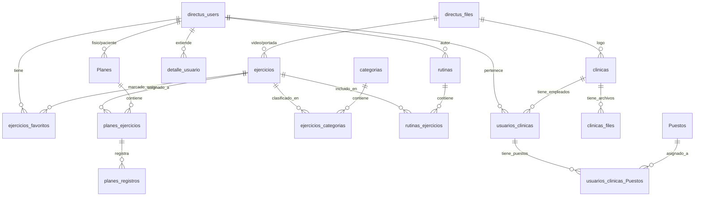

# Estructura de Base de Datos - Kengo

## 1. Introduccion

Este documento describe la estructura de la base de datos de Kengo, una plataforma de gestion para fisioterapeutas que permite administrar ejercicios, rutinas, planes de tratamiento, pacientes y clinicas.

### Stack Tecnologico

- **Motor de Base de Datos**: MySQL 8.0 (InnoDB)
- **CMS Backend**: Directus CMS
- **Charset**: utf8mb4 (soporte completo Unicode)

---

## 2. Diagrama de Entidades



---

## 3. Tablas del Dominio Kengo

### 3.1 Gestion de Ejercicios

#### `ejercicios`
Catalogo principal de ejercicios disponibles en la plataforma.

| Campo | Tipo | Descripcion |
|-------|------|-------------|
| `id_ejercicio` | INT UNSIGNED PK | Identificador unico |
| `nombre_ejercicio` | VARCHAR(255) | Nombre del ejercicio |
| `series_defecto` | VARCHAR(255) | Numero de series por defecto (default: '3') |
| `repeticiones_defecto` | VARCHAR(255) | Repeticiones por defecto (default: '15') |
| `video` | CHAR(36) FK | Referencia a archivo de video |
| `portada` | CHAR(36) FK | Referencia a imagen de portada |
| `descripcion` | TEXT | Descripcion detallada del ejercicio |

**Relaciones:**
- `video` -> `directus_files.id`
- `portada` -> `directus_files.id`

---

#### `categorias`
Categorias para clasificar los ejercicios.

| Campo | Tipo | Descripcion |
|-------|------|-------------|
| `id_categoria` | INT UNSIGNED PK | Identificador unico |
| `nombre_categoria` | VARCHAR(255) | Nombre de la categoria |

---

#### `ejercicios_categorias`
Tabla pivote para la relacion muchos-a-muchos entre ejercicios y categorias.

| Campo | Tipo | Descripcion |
|-------|------|-------------|
| `id` | INT UNSIGNED PK | Identificador unico |
| `ejercicios_id_ejercicio` | INT UNSIGNED FK | Referencia al ejercicio |
| `categorias_id_categoria` | INT UNSIGNED FK | Referencia a la categoria |

**Relaciones:**
- `ejercicios_id_ejercicio` -> `ejercicios.id_ejercicio`
- `categorias_id_categoria` -> `categorias.id_categoria`

---

#### `ejercicios_favoritos`
Ejercicios marcados como favoritos por cada usuario.

| Campo | Tipo | Descripcion |
|-------|------|-------------|
| `id` | INT UNSIGNED PK | Identificador unico |
| `id_usuario` | CHAR(36) FK | Usuario que marco el favorito |
| `id_ejercicio` | INT UNSIGNED FK | Ejercicio marcado |

**Relaciones:**
- `id_usuario` -> `directus_users.id`
- `id_ejercicio` -> `ejercicios.id_ejercicio`

---

### 3.2 Rutinas (Plantillas Reutilizables)

#### `rutinas`
Plantillas de rutinas que pueden reutilizarse para crear planes.

| Campo | Tipo | Descripcion |
|-------|------|-------------|
| `id_rutina` | INT UNSIGNED PK | Identificador unico |
| `user_created` | CHAR(36) FK | Usuario que creo el registro |
| `date_created` | TIMESTAMP | Fecha de creacion |
| `user_updated` | CHAR(36) FK | Usuario que actualizo el registro |
| `date_updated` | TIMESTAMP | Fecha de actualizacion |
| `nombre` | VARCHAR(255) | Nombre de la rutina |
| `descripcion` | VARCHAR(255) | Descripcion de la rutina |
| `autor` | CHAR(36) FK | Fisioterapeuta autor de la rutina |
| `visibilidad` | VARCHAR(255) | Visibilidad: 'privado' (default) o 'publico' |

**Relaciones:**
- `user_created`, `user_updated`, `autor` -> `directus_users.id`

---

#### `rutinas_ejercicios`
Ejercicios que componen cada rutina con su configuracion especifica.

| Campo | Tipo | Descripcion |
|-------|------|-------------|
| `id` | INT UNSIGNED PK | Identificador unico |
| `sort` | INT | Orden del ejercicio en la rutina |
| `date_created` | TIMESTAMP | Fecha de creacion |
| `date_updated` | TIMESTAMP | Fecha de actualizacion |
| `rutina` | INT UNSIGNED FK | Rutina a la que pertenece |
| `ejercicio` | INT UNSIGNED FK | Ejercicio asignado |
| `series` | INT | Numero de series (default: 1) |
| `repeticiones` | INT | Numero de repeticiones (default: 1) |
| `duracion_seg` | INT | Duracion en segundos (para ejercicios de tiempo) |
| `descanso_seg` | INT | Tiempo de descanso en segundos |
| `veces_dia` | INT | Frecuencia diaria (default: 1) |
| `dias_semana` | JSON | Dias de la semana asignados |
| `instrucciones_paciente` | TEXT | Instrucciones para el paciente |
| `notas_fisio` | TEXT | Notas privadas del fisioterapeuta |

**Relaciones:**
- `rutina` -> `rutinas.id_rutina`
- `ejercicio` -> `ejercicios.id_ejercicio`

---

### 3.3 Planes de Tratamiento

#### `Planes`
Planes de tratamiento asignados a pacientes especificos.

| Campo | Tipo | Descripcion |
|-------|------|-------------|
| `id_plan` | INT UNSIGNED PK | Identificador unico |
| `user_created` | CHAR(36) FK | Usuario que creo el registro |
| `date_created` | TIMESTAMP | Fecha de creacion |
| `user_updated` | CHAR(36) FK | Usuario que actualizo el registro |
| `date_updated` | TIMESTAMP | Fecha de actualizacion |
| `titulo` | VARCHAR(255) | Titulo del plan |
| `descripcion` | VARCHAR(255) | Descripcion del plan |
| `estado` | VARCHAR(255) | Estado: 'borrador' (default), 'activo', 'completado' |
| `fecha_inicio` | DATETIME | Fecha de inicio del tratamiento |
| `fecha_fin` | DATETIME | Fecha de finalizacion del tratamiento |
| `paciente` | CHAR(36) FK | Paciente asignado al plan |
| `fisio` | CHAR(36) FK | Fisioterapeuta responsable |

**Relaciones:**
- `user_created`, `user_updated`, `paciente`, `fisio` -> `directus_users.id`

---

#### `planes_ejercicios`
Ejercicios asignados a cada plan con configuracion personalizada.

| Campo | Tipo | Descripcion |
|-------|------|-------------|
| `id` | INT UNSIGNED PK | Identificador unico |
| `sort` | INT | Orden del ejercicio en el plan |
| `date_created` | TIMESTAMP | Fecha de creacion |
| `date_updated` | TIMESTAMP | Fecha de actualizacion |
| `plan` | INT UNSIGNED FK | Plan al que pertenece |
| `ejercicio` | INT UNSIGNED FK | Ejercicio asignado |
| `instrucciones_paciente` | VARCHAR(255) | Instrucciones para el paciente |
| `notas_fisio` | VARCHAR(255) | Notas privadas del fisioterapeuta |
| `series` | INT | Numero de series (default: 1) |
| `repeticiones` | INT | Numero de repeticiones (default: 1) |
| `duracion_seg` | INT | Duracion en segundos |
| `descanso_seg` | INT | Tiempo de descanso en segundos |
| `veces_dia` | INT | Frecuencia diaria (default: 1) |
| `dias_semana` | JSON | Dias de la semana asignados |

**Relaciones:**
- `plan` -> `Planes.id_plan`
- `ejercicio` -> `ejercicios.id_ejercicio`

---

#### `planes_registros`
Historial de ejecucion de ejercicios por los pacientes.

| Campo | Tipo | Descripcion |
|-------|------|-------------|
| `id_registro` | INT UNSIGNED PK | Identificador unico |
| `date_created` | TIMESTAMP | Fecha de creacion del registro |
| `plan_item` | INT UNSIGNED FK | Ejercicio del plan ejecutado |
| `paciente` | CHAR(36) FK | Paciente que realizo el ejercicio |
| `fecha_hora` | DATETIME | Fecha y hora de realizacion |
| `completado` | TINYINT(1) | Si se completo el ejercicio (default: 1) |
| `repeticiones_realizadas` | INT NOT NULL | Repeticiones efectivamente realizadas |
| `duracion_real_seg` | INT | Duracion real en segundos |
| `dolor_escala` | INT | Escala de dolor (0-10, default: 0) |
| `esfuerzo_escala` | INT | Escala de esfuerzo (0-10, default: 0) |
| `nota_paciente` | TEXT | Comentarios del paciente |

**Relaciones:**
- `plan_item` -> `planes_ejercicios.id`
- `paciente` -> `directus_users.id`

---

### 3.4 Clinicas y Usuarios

#### `clinicas`
Informacion de las clinicas de fisioterapia.

| Campo | Tipo | Descripcion |
|-------|------|-------------|
| `id_clinica` | INT UNSIGNED PK | Identificador unico |
| `user_created` | CHAR(36) FK | Usuario que creo el registro |
| `date_created` | TIMESTAMP | Fecha de creacion |
| `user_updated` | CHAR(36) FK | Usuario que actualizo el registro |
| `date_updated` | TIMESTAMP | Fecha de actualizacion |
| `nombre` | VARCHAR(255) | Nombre de la clinica |
| `telefono` | VARCHAR(255) | Telefono de contacto |
| `email` | VARCHAR(255) | Email de contacto |
| `direccion` | VARCHAR(255) | Direccion fisica |
| `postal` | VARCHAR(255) | Codigo postal |
| `nif` | VARCHAR(255) | NIF/CIF de la clinica |
| `logo` | CHAR(36) FK | Logo de la clinica |
| `color_primario` | VARCHAR(255) | Color primario de marca |
| `color_secundario` | VARCHAR(255) | Color secundario de marca |

**Relaciones:**
- `user_created`, `user_updated` -> `directus_users.id`
- `logo` -> `directus_files.id`

---

#### `clinicas_files`
Archivos asociados a cada clinica (documentos, imagenes, etc.).

| Campo | Tipo | Descripcion |
|-------|------|-------------|
| `id` | INT UNSIGNED PK | Identificador unico |
| `clinicas_id_clinica` | INT UNSIGNED FK | Clinica propietaria |
| `directus_files_id` | CHAR(36) FK | Archivo asociado |

**Relaciones:**
- `clinicas_id_clinica` -> `clinicas.id_clinica`
- `directus_files_id` -> `directus_files.id`

---

#### `usuarios_clinicas`
Relacion entre usuarios y clinicas (empleados de cada clinica).

| Campo | Tipo | Descripcion |
|-------|------|-------------|
| `id` | INT UNSIGNED PK | Identificador unico |
| `id_usuario` | CHAR(36) FK | Usuario/empleado |
| `id_clinica` | INT UNSIGNED FK | Clinica donde trabaja |

**Relaciones:**
- `id_usuario` -> `directus_users.id`
- `id_clinica` -> `clinicas.id_clinica`

---

#### `usuarios_clinicas_Puestos`
Puestos de trabajo de cada usuario en cada clinica.

| Campo | Tipo | Descripcion |
|-------|------|-------------|
| `id` | INT UNSIGNED PK | Identificador unico |
| `usuarios_clinicas_id` | INT UNSIGNED FK | Relacion usuario-clinica |
| `Puestos_id` | INT UNSIGNED FK | Puesto asignado |

**Relaciones:**
- `usuarios_clinicas_id` -> `usuarios_clinicas.id`
- `Puestos_id` -> `Puestos.id`

---

#### `Puestos`
Catalogo de puestos de trabajo disponibles.

| Campo | Tipo | Descripcion |
|-------|------|-------------|
| `id` | INT UNSIGNED PK | Identificador unico |
| `puesto` | VARCHAR(255) | Nombre del puesto |

---

#### `detalle_usuario`
Informacion extendida de usuarios (datos personales adicionales).

| Campo | Tipo | Descripcion |
|-------|------|-------------|
| `id_detalle_usuario` | INT UNSIGNED PK | Identificador unico |
| `id_usuario` | CHAR(36) FK | Usuario al que pertenece |
| `dni` | VARCHAR(255) | Documento de identidad |
| `fecha_nacimiento` | DATETIME | Fecha de nacimiento |
| `direccion` | VARCHAR(255) | Direccion |
| `postal` | VARCHAR(255) | Codigo postal |
| `telefono` | VARCHAR(255) | Telefono |
| `sexo` | VARCHAR(255) | Sexo del usuario |

**Relaciones:**
- `id_usuario` -> `directus_users.id`

---

#### `detalle_usuario_clinica`
Tabla auxiliar para relacion detalle_usuario-clinica.

| Campo | Tipo | Descripcion |
|-------|------|-------------|
| `id` | INT UNSIGNED PK | Identificador unico |
| `detalle_usuario_id_detalle_usuario` | INT UNSIGNED FK | Detalle de usuario |

**Relaciones:**
- `detalle_usuario_id_detalle_usuario` -> `detalle_usuario.id_detalle_usuario`

---

## 4. Tablas de Directus (Sistema)

### 4.1 Usuarios y Autenticacion

#### `directus_users`
Tabla principal de usuarios del sistema, extendida con campos especificos de Kengo.

| Campo | Tipo | Descripcion |
|-------|------|-------------|
| `id` | CHAR(36) PK | UUID del usuario |
| `first_name` | VARCHAR(50) | Nombre |
| `last_name` | VARCHAR(50) | Apellido |
| `email` | VARCHAR(128) UNIQUE | Email (unico) |
| `password` | VARCHAR(255) | Contrasena hash |
| `status` | VARCHAR(16) | Estado: 'active' (default), 'invited', 'suspended' |
| `role` | CHAR(36) FK | Rol asignado |
| `token` | VARCHAR(255) UNIQUE | Token de API |
| `last_access` | TIMESTAMP | Ultimo acceso |
| `provider` | VARCHAR(128) | Proveedor de autenticacion (default: 'default') |
| **Campos Kengo:** | | |
| `telefono` | VARCHAR(255) | Telefono de contacto |
| `direccion` | VARCHAR(255) | Direccion |
| `postal` | VARCHAR(255) | Codigo postal |
| `magic_link_url` | TEXT | URL para magic link de autenticacion |
| `numero_colegiado` | VARCHAR(255) | Numero de colegiado (fisioterapeutas) |

---

#### `directus_roles`
Roles de usuario del sistema.

| Campo | Tipo | Descripcion |
|-------|------|-------------|
| `id` | CHAR(36) PK | UUID del rol |
| `name` | VARCHAR(100) | Nombre del rol |
| `icon` | VARCHAR(64) | Icono (default: 'supervised_user_circle') |
| `description` | TEXT | Descripcion del rol |
| `parent` | CHAR(36) FK | Rol padre (herencia) |

---

#### `directus_policies`
Politicas de control de acceso.

| Campo | Tipo | Descripcion |
|-------|------|-------------|
| `id` | CHAR(36) PK | UUID de la politica |
| `name` | VARCHAR(100) | Nombre de la politica |
| `admin_access` | TINYINT(1) | Acceso de administrador |
| `app_access` | TINYINT(1) | Acceso a la aplicacion |
| `enforce_tfa` | TINYINT(1) | Requiere autenticacion de dos factores |

---

#### `directus_permissions`
Permisos especificos por coleccion y accion.

| Campo | Tipo | Descripcion |
|-------|------|-------------|
| `id` | INT UNSIGNED PK | Identificador unico |
| `collection` | VARCHAR(64) | Coleccion afectada |
| `action` | VARCHAR(10) | Accion: create, read, update, delete |
| `permissions` | JSON | Filtros de permiso |
| `validation` | JSON | Reglas de validacion |
| `fields` | TEXT | Campos permitidos |
| `policy` | CHAR(36) FK | Politica asociada |

---

#### `directus_access`
Asignacion de politicas a roles/usuarios.

| Campo | Tipo | Descripcion |
|-------|------|-------------|
| `id` | CHAR(36) PK | UUID |
| `role` | CHAR(36) FK | Rol asignado |
| `user` | CHAR(36) FK | Usuario asignado |
| `policy` | CHAR(36) FK | Politica asignada |

---

### 4.2 Gestion de Archivos

#### `directus_files`
Archivos subidos al sistema.

| Campo | Tipo | Descripcion |
|-------|------|-------------|
| `id` | CHAR(36) PK | UUID del archivo |
| `storage` | VARCHAR(255) | Almacenamiento usado |
| `filename_disk` | VARCHAR(255) | Nombre en disco |
| `filename_download` | VARCHAR(255) | Nombre para descarga |
| `title` | VARCHAR(255) | Titulo del archivo |
| `type` | VARCHAR(255) | Tipo MIME |
| `folder` | CHAR(36) FK | Carpeta contenedora |
| `filesize` | BIGINT | Tamano en bytes |
| `width` | INT UNSIGNED | Ancho (imagenes) |
| `height` | INT UNSIGNED | Alto (imagenes) |
| `duration` | INT UNSIGNED | Duracion (videos) |

---

#### `directus_folders`
Organizacion de carpetas para archivos.

| Campo | Tipo | Descripcion |
|-------|------|-------------|
| `id` | CHAR(36) PK | UUID de la carpeta |
| `name` | VARCHAR(255) | Nombre de la carpeta |
| `parent` | CHAR(36) FK | Carpeta padre |

---

### 4.3 Auditoria y Versionado

#### `directus_activity`
Registro de actividad del sistema.

| Campo | Tipo | Descripcion |
|-------|------|-------------|
| `id` | INT UNSIGNED PK | Identificador unico |
| `action` | VARCHAR(45) | Tipo de accion realizada |
| `user` | CHAR(36) | Usuario que realizo la accion |
| `timestamp` | TIMESTAMP | Fecha y hora |
| `collection` | VARCHAR(64) | Coleccion afectada |
| `item` | VARCHAR(255) | Item afectado |

---

#### `directus_revisions`
Historial de cambios para auditoria.

| Campo | Tipo | Descripcion |
|-------|------|-------------|
| `id` | INT UNSIGNED PK | Identificador unico |
| `activity` | INT UNSIGNED FK | Actividad asociada |
| `collection` | VARCHAR(64) | Coleccion afectada |
| `item` | VARCHAR(255) | Item afectado |
| `data` | JSON | Datos del registro |
| `delta` | JSON | Cambios realizados |

---

### 4.4 Otras Tablas de Sistema

| Tabla | Descripcion |
|-------|-------------|
| `directus_collections` | Metadatos de colecciones (configuracion de UI) |
| `directus_fields` | Definicion de campos personalizados |
| `directus_relations` | Configuracion de relaciones entre colecciones |
| `directus_settings` | Configuracion global del proyecto |
| `directus_sessions` | Sesiones activas de usuarios |
| `directus_flows` | Automatizaciones y flujos de trabajo |
| `directus_operations` | Pasos dentro de flujos automatizados |
| `directus_dashboards` | Paneles de control personalizados |
| `directus_panels` | Widgets dentro de dashboards |
| `directus_presets` | Configuraciones guardadas de vistas |
| `directus_notifications` | Sistema de notificaciones internas |
| `directus_comments` | Comentarios en registros |
| `directus_shares` | Enlaces compartidos para acceso publico |
| `directus_versions` | Control de versiones de contenido |
| `directus_translations` | Traducciones multiidioma |
| `directus_migrations` | Historial de migraciones de base de datos |
| `directus_extensions` | Extensiones instaladas |

---

## 5. Relaciones Clave (Foreign Keys)

### Ejercicios y Categorias
```
ejercicios.video -> directus_files.id
ejercicios.portada -> directus_files.id
ejercicios_categorias.ejercicios_id_ejercicio -> ejercicios.id_ejercicio
ejercicios_categorias.categorias_id_categoria -> categorias.id_categoria
ejercicios_favoritos.id_usuario -> directus_users.id
ejercicios_favoritos.id_ejercicio -> ejercicios.id_ejercicio
```

### Rutinas
```
rutinas.autor -> directus_users.id
rutinas.user_created -> directus_users.id
rutinas_ejercicios.rutina -> rutinas.id_rutina
rutinas_ejercicios.ejercicio -> ejercicios.id_ejercicio
```

### Planes de Tratamiento
```
Planes.paciente -> directus_users.id
Planes.fisio -> directus_users.id
planes_ejercicios.plan -> Planes.id_plan
planes_ejercicios.ejercicio -> ejercicios.id_ejercicio
planes_registros.plan_item -> planes_ejercicios.id
planes_registros.paciente -> directus_users.id
```

### Clinicas
```
clinicas.logo -> directus_files.id
clinicas_files.clinicas_id_clinica -> clinicas.id_clinica
clinicas_files.directus_files_id -> directus_files.id
usuarios_clinicas.id_usuario -> directus_users.id
usuarios_clinicas.id_clinica -> clinicas.id_clinica
usuarios_clinicas_Puestos.usuarios_clinicas_id -> usuarios_clinicas.id
usuarios_clinicas_Puestos.Puestos_id -> Puestos.id
```

### Usuarios
```
directus_users.role -> directus_roles.id
detalle_usuario.id_usuario -> directus_users.id
detalle_usuario_clinica.detalle_usuario_id_detalle_usuario -> detalle_usuario.id_detalle_usuario
```

---

## 6. Notas de Implementacion

### Convenciones de Nombres
- Las tablas de Directus usan el prefijo `directus_`
- Las tablas de dominio Kengo usan nombres en espanol sin prefijo
- Las PKs usan el formato `id_<entidad>` o simplemente `id`
- Las FKs usan el formato `<entidad>_id_<entidad>` para tablas pivote

### Tipos de Datos Comunes
- **UUIDs**: Usados para identificadores en tablas de Directus (`CHAR(36)`)
- **Auto-increment**: Usados para identificadores en tablas de dominio (`INT UNSIGNED`)
- **Timestamps**: Campos de auditoria (`user_created`, `date_created`, etc.)
- **JSON**: Para datos flexibles (`dias_semana`, `metadata`, etc.)

### Campos de Auditoria
Todas las tablas principales incluyen campos de auditoria:
- `user_created`: Usuario que creo el registro
- `date_created`: Fecha de creacion
- `user_updated`: Usuario que actualizo el registro
- `date_updated`: Fecha de actualizacion

### Comportamiento ON DELETE
- La mayoria de FKs usan `ON DELETE SET NULL` para preservar integridad
- Las tablas de Directus pueden usar `ON DELETE CASCADE` para limpieza automatica
